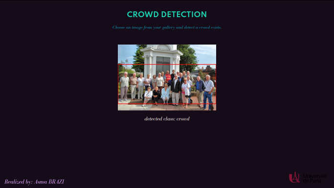

# Crowd detection using fractal dimension and local density
This repository contains the complete code of my university project, named "Crowd detection using fractal dimension and local density". Crowd detection is the task of classifying and localizing crowd in images. 

In this project, I am particularly interested in pedestrians crowd detection. I mostly used image processing methods to isolate the crowd from non-interesting objetcs and background. Specifically, the classification task is based on fractal dimension and the localization task is based on local density.

I have written a complete article to explain the solution. The article is available at [*Crowd detection article*](https://asmabrz.github.io/2021/01/17/crowd-detection.html)

I have constructed a web application to test the proposed solution.  [*Click here to test the Crowd Detection App*](https://crowd-detection-app.herokuapp.com/)

Web application :

## Credits
The fractal dimension computation originates from [*Github repository*](https://github.com/ErikRZH/Fractal-Dimension).
